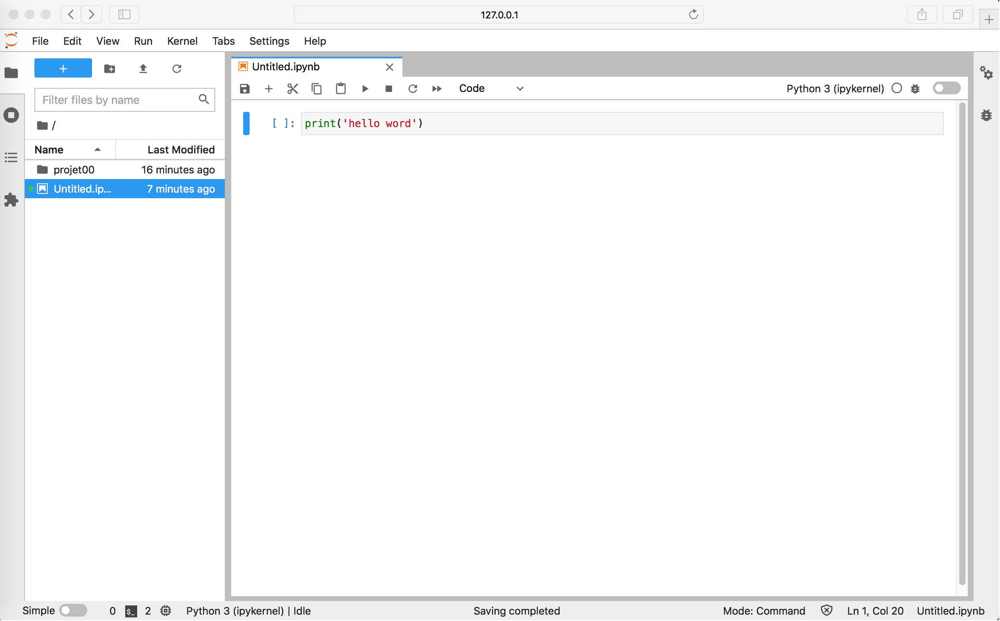

# Write your first python code with JupyterLab

## Prerequisite  
Docker  
(for the first use, download it on  https://www.docker.com/products/docker-desktop)

## Run JupyterLab
-In your Terminal window:  
`$ docker-compose up`

-In your web-browser window:  
`http://127.0.0.1:8888/lab`

-In the Launcher tab:  
Open a `"Python3" Notebook`

-For more codes, go to `project00` or create your own project by creating a new forlder `project01`, ...